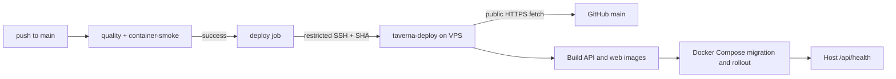

# CD на VPS при push в `main`

## Цель

Каждый успешный push в `main` автоматически развёртывает точный commit на production VPS. До появления домена приложение доступно только по `http://<IP-сервера>` на TCP/80. Конфигурация не переносит пароль из `.creds` в GitHub, репозиторий, Docker-образы или логи.

## Зафиксированные ограничения

- Существующий CI уже проверяет `quality` и `container-smoke` на push в `main`.
- Production Compose ожидает готовые API и web images, выполняет Prisma migration и проверяет health API.
- Nginx служит HTTP reverse proxy, а `APP_ORIGIN` в production Compose передаётся явно.
- Production session cookie всегда `Secure`; без явного исключения браузер не сможет авторизоваться по HTTP.
- .creds игнорируется Git, но пароль, переданный в переписке, должен быть вручную ротирован владельцем до работы с реальными данными.

## Решение

Используется server-side pull and build. GitHub Actions не строит production images и не хранит registry-token: после успешного CI он запускает на VPS единственный ограниченный deploy command. VPS читает публичный репозиторий по HTTPS без GitHub credentials, собирает images локально и применяет Compose.

Отклонены:

1. GHCR: лучше воспроизводимость и меньше нагрузка на VPS, но нужны registry, lifecycle образов и read-only token на production-хосте.
2. Self-hosted GitHub runner: отсутствует входящее SSH-подключение, но runner получает расширенную поверхность доступа к production-хосту и требует постоянного обслуживания.

## Доверенные границы и секреты

### Одноразовый bootstrap

Локальный bootstrap использует credential только для первичного доступа к VPS. Он:

- проверяет Docker Engine, Compose v2, Git и Curl;
- создаёт отдельного пользователя `taverna-deploy` с доступом к Docker;
- настраивает HTTPS remote для публичного репозитория без credentials на VPS;
- создаёт GitHub-Actions-to-server key; его public часть фиксируется в `authorized_keys` с forced command, `no-pty`, `no-port-forwarding`, `no-agent-forwarding` и `no-X11-forwarding`;
- устанавливает root-owned `/usr/local/sbin/taverna-deploy`, который принимает только `deploy <40-hex-sha>`;
- записывает `/etc/taverna/production.env` с режимом `0600` и случайными значениями PostgreSQL/JWT. Demo seed выключен.

Bootstrap не меняет `PasswordAuthentication` и `PermitRootLogin`: ограниченный Actions key не даёт административного shell, а отключение единственного проверенного доступа заблокировало бы владельца. Пароль из `.creds` остаётся временным административным credential и, поскольку он был передан в переписке, должен быть отдельно ротирован владельцем до работы с реальными данными. После появления отдельного проверенного admin SSH key нужно отключить password и root SSH login.

### GitHub

У GitHub Actions один environment secret: `DEPLOY_SSH_PRIVATE_KEY`. В workflow также лежит точный public host key VPS; подключение всегда использует `StrictHostKeyChecking=yes` и `IdentitiesOnly=yes`. Для чтения публичных исходников VPS не хранит GitHub credential и не требует repository deploy key.

Ни `.creds`, ни production `.env`, ни значения secrets не читаются или не печатаются workflow.

## Путь развёртывания

1. Новый `deploy` job добавляется в `.github/workflows/ci.yml`; он зависит от `quality` и `container-smoke`, исполняется только для `push` в `main` и сериализован отдельной deployment concurrency group без отмены уже идущего rollout.
2. Job передаёт SHA через SSH key. Forced command на VPS отвергает произвольные команды.
3. `/usr/local/sbin/taverna-deploy` проверяет формат SHA, fetches `origin/main` и развёртывает только SHA, совпадающий с текущим tip ветки. Устаревший job завершится ошибкой, а следующий job развёрнёт актуальный commit.
4. Скрипт детачит checkout на SHA, локально собирает `taverna-api:<sha>` и `taverna-web:<sha>`, затем запускает `docker compose -f infra/compose.prod.yml` с этими immutable local tags и `APP_VERSION=<sha>`.
5. Compose ждёт PostgreSQL, выполняет migration, поднимает API и Nginx. Скрипт проверяет публичный проксированный `http://127.0.0.1/api/health` с VPS и оставляет диагностические Compose logs при ошибке.

Автоматического rollback нет: откат контейнера после уже применённой Prisma migration может повредить данные. Неудачный rollout остаётся остановленным с наблюдаемым ошибочным job; rollback выполняется только после проверки совместимости migration.

## Изменения конфигурации приложения

- `infra/nginx.conf` обслуживает SPA и проксирует `/api/*` в API; HTTPS не включён до появления домена.
- `infra/compose.prod.yml` принимает обязательный `APP_ORIGIN`, а не выводит его как HTTPS URL; на временном production-хосте это `http://<IP-сервера>`. В production публикуется только порт 80.
- `apps/api/src/lib/env.ts` получает явный opt-in `ALLOW_INSECURE_SESSION_COOKIES` со значением `false` по умолчанию.
- `apps/api/src/plugins/auth.ts` сохраняет `Secure` cookie во всех production развёртываниях, кроме явного временного opt-in. `SameSite=Lax` и `HttpOnly` не меняются.
- Production environment содержит `ALLOW_INSECURE_SESSION_COOKIES=true` только до перехода на HTTPS. Переход на домен должен вернуть значение к `false`, восстановить `https://` origin и TCP/443.

## Проверка

До deploy job:

- регрессионный тест подтверждает `Secure` у standard production cookie и его отсутствие только при явном temporary opt-in;
- `docker compose config` проходит для production HTTP environment;
- существующие lint, typecheck, test, build и development container smoke проходят.

После rollout:

- GitHub Actions job завершён успешно;
- VPS подтверждает public proxy health endpoint;
- браузер получает session cookie при регистрации/логине по временно разрешённому HTTP URL.

## Риски

Публичный HTTP сознательно небезопасен: session token и пользовательские данные могут быть перехвачены в сети. Это допустимо только как временная мера, подтверждённая владельцем, и при появлении домена должно быть заменено на HTTPS до использования с реальными данными.

Оставленный временный root/password login — дополнительный административный риск; pipeline не использует этот пароль, но он не может считаться безопасным после передачи в переписке. Без отдельного admin public key автоматическое отключение этого доступа намеренно не выполняется, чтобы не заблокировать владельца.
